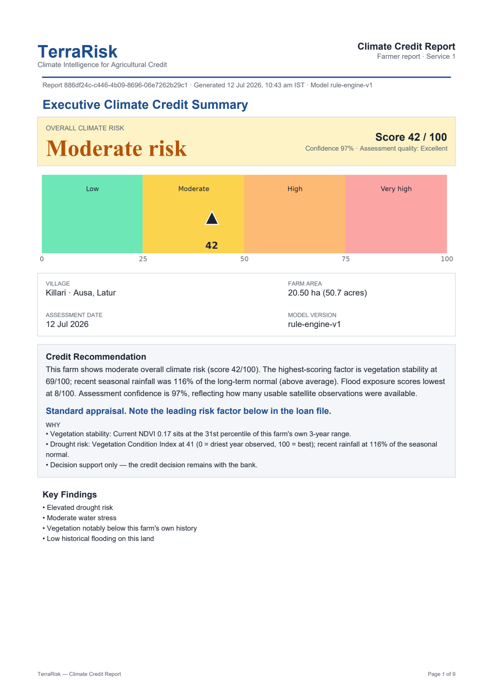
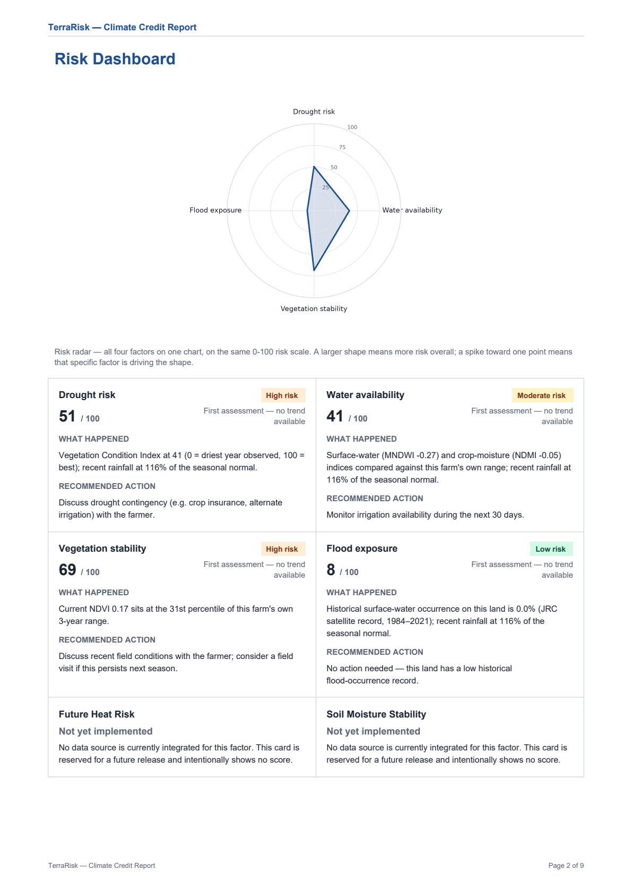

# TerraRisk

[](https://github.com/prathmeshsonvane4-cloud/terrarisk-platform/actions/workflows/ci.yml)


Climate and water risk intelligence for agricultural lending and watershed
programmes. TerraRisk turns a location — a farm boundary or a village
catchment — into a transparent, evidence-backed report that a credit
officer or a programme officer can act on.

Built around two real deployments: a district cooperative bank in Latur,
and village-scale water intelligence across Maski taluka, Raichur.

## Overview

Two services, one platform. Both are built and running against live
Google Earth Engine data.

**1. Farmer Climate Intelligence Report.** A credit officer draws a farm
boundary on a satellite map. TerraRisk pulls multi-year vegetation, water
and rainfall series for that exact polygon, and a rule-based engine
produces a Climate Risk Score with a visible factor breakdown and a
7-section PDF.

**2. Water Intelligence.** Village-scale water balance and recharge stress
across a whole taluka — 141 village catchments on a choropleth, so
villages can be compared and ranked rather than read one at a time. Each
catchment gets a rainfall / evapotranspiration / runoff / storage-change
balance broken down **by water year (June–May)**, so a monsoon stays in
one row instead of being split across two by a calendar boundary.

Scoring is deliberately **rule-based and configurable**, not an opaque ML
prediction. A bank has to understand a score before acting on it, and a
hydrologist has to be able to check one. Every architectural choice is
recorded in [`docs/DECISIONS.md`](docs/DECISIONS.md).

## Engineering notes

The parts of this repository most worth reading are about correctness and
honesty, not features.

### A hydrology audit of our own output

Every test passed and every number looked plausible, so the engine was
audited against the source-data documentation and published literature
ranges instead. That found six real defects:

| Defect | Effect |
| --- | --- |
| MOD16A2 evapotranspiration is an **8-day cumulative composite**, not a rate — it was being read as a rate | ET roughly **4× too low** |
| SCS Curve Number is a **single-storm-event** method — it was being applied at a monthly timestep | Runoff roughly **20× too high** |
| Curve Number set for the wrong hydrologic soil group | Wrong for Deccan black-cotton vertisols (HSG D) |
| Five scorers ranked each reading against **all months mixed together** | Measured seasonal position, not anomaly |
| Sentinel-1 backscatter averaged in **dB** rather than linear power | Arithmetic mean of a logarithm |
| Sub-pixel resolution flags computed but never surfaced | A real caveat, invisible to the reader |

The two timestep bugs had to ship together: fixing ET alone would have
flipped storage change into a spurious depletion. Post-fix figures sit
inside published ranges for the semi-arid Deccan.

**The transferable lesson: passing tests told us nothing here.** Units,
timesteps and literature ranges were what caught these.

### Saying what the numbers cannot support

- **Storage change is labelled a residual, not recharge.** It is
  `P − ET − Q`, so it also absorbs deep percolation leaving the catchment
  and all model error in the three larger terms.
- **The closed-catchment assumption is disclosed next to the figures it
  affects**, and its wording depends on how the boundary was drawn — a
  DEM-delineated watershed and a hand-traced revenue village cannot carry
  the same caveat, because water crosses administrative lines freely.
- **Sub-pixel warnings are shown above the numbers, not in a footnote.**
  One CHIRPS cell covers ~3,000 ha; a 250 ha catchment's rainfall figure
  describes its surroundings, and a reader who sees the millimetres first
  has already formed the wrong impression.
- **Partial water years are drawn faded and labelled** with their month
  count, so a two-month stub at the edge of the window is never read as a
  catastrophically dry year.

### Making Earth Engine's limits explicit

Earth Engine evaluates `ee.List(periods).map(...)` as that many
*concurrent* aggregations inside one request, so the **fan-out** — not the
total work — is what trips a project's ceiling. A 36-month Sentinel-2
series over a 1,649 ha catchment was refused outright while the same query
for a single month returned in 1.5s.

The ceiling was measured rather than guessed (18 periods refused, 12
accepted, and 12/9/6/4/3 all returning in 6–8s), then handled by
requesting periods in batches that **halve themselves when still refused**.
The ceiling scales with how expensive each aggregation is, which depends
on catchment area and geometry — a property of the data, not a constant
the code can know in advance.

### Bugs that fail silently

Three separate defects each quietly truncated data rather than erroring:
an unpaginated frontend fetch capped at the API's default page size, an
nginx rate limit rejecting rather than queueing burst traffic, and a
batch script repeating the same pagination mistake. All three produced
plausible-looking output with most of the data missing.

## Architecture

```
                    ┌───────────┐
   Browser  ───────▶│   nginx   │  reverse proxy, gzip, security headers,
                    │  (prod)   │  rate limiting, static caching
                    └─────┬─────┘
                 ┌────────┴────────┐
                 ▼                 ▼
         ┌───────────────┐  ┌───────────────┐
         │   frontend    │  │    backend    │
         │  Next.js 15   │  │   FastAPI     │──────▶ Google Earth Engine
         │ (standalone)  │  │  (uvicorn)    │        Sentinel-1/2, MODIS,
         └───────────────┘  └───────┬───────┘        CHIRPS, SRTM
                                    ▼
                            ┌───────────────┐
                            │ PostgreSQL 16 │
                            │  + PostGIS    │
                            └───────────────┘
```

- **Frontend** — Next.js App Router, MapLibre GL + Terra Draw for boundary
  drawing, TanStack Query for server state, and a typed API client
  generated from the backend's own OpenAPI schema.
- **Backend** — FastAPI (async), SQLAlchemy 2.0 + PostGIS, pure rule-based
  engines, Earth Engine reached only through a swappable provider
  interface so every engine is testable without network access.
- **nginx** — one public origin in production, proxying `/api/` to the
  backend and everything else to the frontend.

Full detail in [`docs/Engineering_Blueprint_v1.md`](docs/Engineering_Blueprint_v1.md)
and [`docs/Product_Design_v2.md`](docs/Product_Design_v2.md).

## Features

**Shared**

- Server-authoritative geometry: area is computed in PostGIS, never
  trusted from the client's preview.
- Async job tracking for long-running Earth Engine work, with live
  progress polling.
- Role-scoped access with a deliberate separation between bank roles and
  programme roles, so a wrong-product caller gets a distinct 403.
- Retry with exponential backoff and jitter on transient Earth Engine
  throttling; non-transient errors still fail fast rather than burning
  quota to reach the same failure.

**Service 1 — Farm**

- Farm boundary drawing on a real satellite basemap.
- Multi-year NDVI / MNDWI / NDMI and rainfall series per polygon.
- Configurable Climate Risk Score with a per-factor breakdown and a
  floor rule for severe individual factors.
- 7-section PDF report with time-series charts and a methodology section.

**Service 2 — Water**

- Taluka-wide choropleth across 141 village catchments.
- Water balance per catchment, broken down by water year (June–May).
- Recharge stress from rainfall anomaly, VCI and surface-water trend,
  each compared against the **same calendar month** over an 8-year
  baseline (bounded by Sentinel-2 L2A availability, not chosen).
- Assumption and resolution-limit disclosures on screen and in the PDF.
- Priority queue and catchment comparison views.

## Technology stack

| Layer | Technology |
| --- | --- |
| Frontend | Next.js 15, React 19, TypeScript, Tailwind CSS v4, shadcn/ui, MapLibre GL, Terra Draw, TanStack Query |
| Backend | FastAPI, SQLAlchemy 2.0 (async), Alembic, Pydantic |
| Database | PostgreSQL 16 + PostGIS 3.4 |
| Earth observation | Google Earth Engine — Sentinel-1 SAR, Sentinel-2 L2A, MODIS MOD16A2, CHIRPS, SRTM |
| Reporting | ReportLab, Matplotlib (server), jsPDF (client) |
| Auth | Bearer JWT (PyJWT), bcrypt |
| Infra | Docker, Docker Compose, nginx |

## Quick start (Docker)

Requires Docker and Docker Compose.

```bash
git clone <repo-url> && cd terrarisk-platform
cp .env.example .env    # fill in real secrets — see the comments in the file
docker compose --env-file .env -f docker/docker-compose.prod.yml up -d --build
```

Then create the first account inside the container:

```bash
docker compose --env-file .env -f docker/docker-compose.prod.yml exec backend python scripts/create_admin_user.py --email you@example.com --password 'a-real-password' --full-name "Your Name" --role branch_manager
```

Open `http://localhost/`. Full walkthrough, including SSL and domain
setup, in [`docs/Getting_Started.md`](docs/Getting_Started.md).

## Testing

```bash
cd backend && pytest
cd frontend && npm test && npx tsc --noEmit && npm run lint
```

Engine tests run against a fake satellite provider, so the full suite
needs no Earth Engine credentials and no network. Tests that do require
credentials skip themselves explicitly rather than silently passing.

Golden-dataset tests pin exact numeric outputs with the derivation shown
in the test docstring, so a change in engine behaviour has to be
acknowledged rather than absorbed.

## Project structure

```
terrarisk-platform/
├── backend/          # FastAPI service — see backend/README.md
├── frontend/         # Next.js application — see frontend/README.md
├── docker/           # Dockerfiles, compose stacks, nginx config
├── docs/             # Blueprint, product design, decision log, guides
├── data/             # Datasets and reference data
├── infrastructure/   # Reserved for future IaC
└── scripts/          # Repo-level utilities
```

## Screenshots

Real renderer output on fixture data, not mockups:

| Executive Summary | Risk Dashboard |
| --- | --- |
| [](docs/screenshots/report-page1-executive-summary.png) | [](docs/screenshots/report-page2-risk-dashboard.png) |

## Roadmap

- [x] Farm boundary drawing with server-authoritative area calculation
- [x] Multi-year Earth Engine series (NDVI/MNDWI/NDMI/rainfall) per farm
- [x] Rule-based Climate Risk Score with per-factor breakdown
- [x] 7-section PDF Climate Credit Report
- [x] Async report generation with live progress tracking
- [x] Water Intelligence: taluka-wide village catchments and choropleth
- [x] Water balance by water year, with partial-year handling
- [x] Seasonal (same-calendar-month) baselines across both services
- [x] Assumption, calibration and resolution-limit disclosure
- [x] Production deployment (Docker Compose + nginx)
- [ ] HTTPS on the live pilot deployment (pending a domain)
- [ ] Cache the multi-year baseline fetches to cut per-report EE cost
- [ ] Groundwater level anomaly prediction, validated against
      independent well observations with spatial cross-validation
- [ ] Portfolio rollups (village / branch / district)

## License

See [`LICENSE`](LICENSE) — all rights reserved. This repository is public
for portfolio, demonstration and evaluation purposes. It is not open
source, and no licence to use, modify or deploy the code is granted
without written permission.
