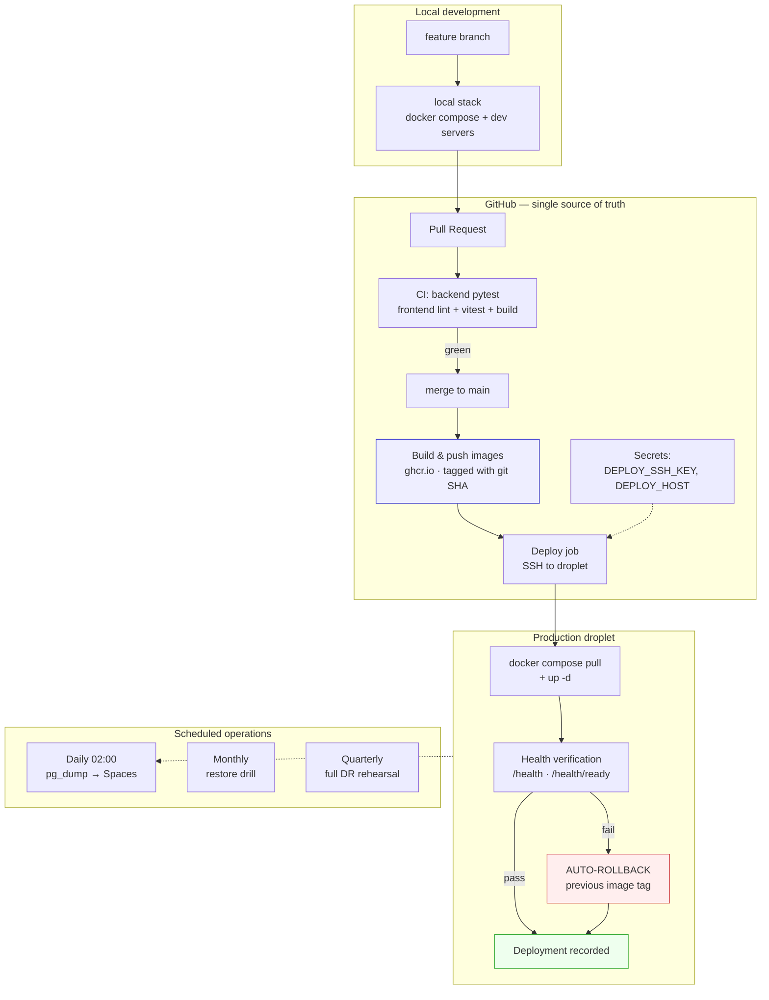

# TerraRisk DevOps Workflow

**Status:** DESIGN ONLY. Nothing executed.
**Companion to:** `Production_V2_Plan.md` (infrastructure) and `Deployment_Guide.md` (manual runbook).
**Design constraints:** reliability · simplicity · maintainability. No Kubernetes. No service mesh. No enterprise observability. One droplet, one founder.

---

## 1. Updated Production V2 Architecture

Three approved decisions are now folded in: **production domain**, **DO Spaces backups**, **Docker log rotation**.

```
                          ┌──────────────────────────┐
        DNS (A record) ──►│   Reserved IP (static)   │  survives droplet rebuild
   terrarisk.<tld>        └────────────┬─────────────┘
                                       │
                          ┌────────────▼─────────────┐
                          │  DO Cloud Firewall       │  in: 22, 80, 443 only
                          └────────────┬─────────────┘
                                       │
   ┌───────────────────────────────────▼────────────────────────────────────┐
   │  Droplet  s-2vcpu-4gb · Ubuntu 24.04 LTS · BLR1 · terrarisk-prod-v2    │
   │  UFW · fail2ban · unattended-upgrades · non-root `deploy` user         │
   │                                                                        │
   │   ┌──────────────────────────────────────────────────────────────┐    │
   │   │  nginx :80/:443  (only published ports · TLS via Let's Encrypt)│   │
   │   └───────┬──────────────────────────────────┬───────────────────┘    │
   │           │ /api/*                           │ /*                     │
   │   ┌───────▼────────┐                 ┌───────▼────────┐               │
   │   │  backend       │                 │  frontend      │               │
   │   │  FastAPI       │                 │  Next.js       │               │
   │   │  alembic@start │                 │  standalone    │               │
   │   └───────┬────────┘                 └────────────────┘               │
   │           │                                                            │
   │   ┌───────▼────────────────────────┐   network: terrarisk_net          │
   │   │  postgres  postgis/postgis:16  │   volumes: postgres_data ★        │
   │   └───────┬────────────────────────┘            pdf_cache, uploads     │
   │           │                                     (regenerable)          │
   │   all services: json-file logging, max-size 10m, max-file 3            │
   └───────────┼────────────────────────────────────────────────────────────┘
               │ 02:00 daily  pg_dump | gzip
               ▼
   ┌───────────────────────────┐        ┌────────────────────────────┐
   │  DO Spaces (off-host)     │        │  DO weekly droplet snapshot│
   │  7 daily/4 weekly/3 month │        │  whole-machine recovery    │
   └───────────────────────────┘        └────────────────────────────┘

   ★ postgres_data is the ONLY irreplaceable volume. Everything else is
     rebuildable from git + committed fixtures.
```

**What changed vs V1, and which V1 failure each fixes:**

| V2 element | V1 failure it prevents |
|---|---|
| Reserved IP | Losing the public address with the droplet |
| Off-host daily dumps → Spaces | Total data loss |
| Encrypted secrets escrow (off-server) | Inability to reconstitute the environment |
| Domain + TLS | Demo credibility; also decouples identity from any single IP |
| Log rotation | Silent disk-full death |
| Monitoring + uptime check | Discovering an outage days late, by accident |

---

## 2. DevOps Architecture

**GitHub is the single source of truth.** Code, deployment process, reference data fixtures, CI/CD definitions, and infrastructure documentation all live there. Nothing required to rebuild production exists only on a server.



### Why images-in-a-registry, not build-on-server

This is the one place I recommend changing V1's approach, and the reason is **rollback quality**, which is the single biggest reliability lever available to us.

| | Build on droplet (V1) | Build in CI → GHCR (V2) |
|---|---|---|
| Rollback | Check out an older commit and rebuild — and *hope* the rebuild is identical | `docker compose up` with the previous tag. Seconds. Byte-identical |
| Reproducibility | Base images and transitive deps drift between builds | The artifact deployed is the artifact tested |
| Failed build | Can leave production half-deployed | Never touches production; deploy job simply doesn't run |
| Droplet RAM | Must carry `next build` headroom (4 GB) | Only runs containers — can shrink later |
| Complexity | Lower | One registry login, image tags in compose |

GHCR is free, requires no third-party account, and authenticates with the automatically-scoped `GITHUB_TOKEN`. This is not enterprise infrastructure — it is `docker push` and `docker pull`.

**Compose change required:** `backend` and `frontend` switch from `build:` to `image: ghcr.io/<org>/terrarisk-{backend,frontend}:${IMAGE_TAG}`. A `docker-compose.build.yml` overlay retains local building for development.

### Branching — deliberately minimal

`main` is production. Feature branch → PR → CI green → merge → auto-deploy. No `develop`, no release branches, no gitflow. For one engineer, extra branches are ceremony that slows delivery without reducing risk.

### On staging: **not yet, and here's the honest reasoning**

A staging droplet doubles infrastructure cost for a pre-revenue company. What actually protects production at this stage:

1. CI runs both full suites (556 backend, 110+ frontend) before anything merges
2. The local stack is a genuine pre-production environment
3. Post-deploy health verification with automatic rollback
4. Rollback is seconds, not a rebuild

**Add staging when:** a paying customer would notice a five-minute outage, or a second engineer joins. Not before.

---

## 3. Deployment Workflow

### 3.1 Pipeline

```
merge to main
   │
   ├─ Job 1  TEST      backend pytest · frontend lint/vitest/build      (~6 min)
   │            └─ fail → stop. Production untouched.
   │
   ├─ Job 2  BUILD     docker build backend + frontend
   │                   tag: ghcr.io/…:<git-sha>  and  :latest
   │                   push to GHCR                                     (~5 min)
   │            └─ fail → stop. Production untouched.
   │
   └─ Job 3  DEPLOY    SSH to droplet as `deploy`                       (~2 min)
                       1. record current IMAGE_TAG  → ROLLBACK_TAG
                       2. write new IMAGE_TAG to .env
                       3. docker compose pull
                       4. docker compose up -d          (alembic runs on backend start)
                       5. wait for container health
                       6. VERIFY (§3.2)
                          ├─ pass → prune old images, keep last 5
                          └─ fail → AUTO-ROLLBACK (§3.3), fail the workflow
```

**Manual deploy** of any tag is available via `workflow_dispatch` — needed for rollback-to-arbitrary-version and for redeploying after infrastructure work.

### 3.2 Deployment health verification

Run by the deploy job, against the public domain, after every deploy:

| # | Check | Pass condition |
|---|---|---|
| V1 | All four containers report healthy | `docker compose ps` — no `unhealthy`/`exited` |
| V2 | `GET /health` | `200` |
| V3 | `GET /health/ready` | `200` — this is the meaningful one: it checks DB connectivity **and** Earth Engine configuration |
| V4 | Frontend root | `200`, HTML response |
| V5 | TLS certificate | valid, >14 days to expiry |
| V6 | Migration state | `alembic current` matches `head` |

Any failure → automatic rollback. **`/health/ready` is the check that would have caught V1's real, months-long silent failure** (GEE credentials missing from the container, so every report job failed immediately while the app looked fine).

### 3.3 Rollback strategy

**Code rollback — fast and safe:**
```bash
# on droplet, or via workflow_dispatch
IMAGE_TAG=<previous-sha> docker compose --env-file .env -f docker/docker-compose.prod.yml up -d
```
Seconds. The previous image is already on disk (we keep the last 5). Automatic on health-check failure.

**Schema rollback — slow and dangerous. Be honest about this:**

Code rollback does **not** roll back the database. `alembic downgrade` can permanently lose data for any migration that drops a column or table.

**The discipline that makes this a non-issue: keep migrations backward-compatible.** A new column must be nullable or defaulted so the previous image still runs against the new schema. Destructive changes are split across two releases (stop writing → later, drop). With that discipline, code rollback is always safe and schema rollback is almost never needed.

**If a destructive migration must be reverted:** restore from the most recent `pg_dump` (§4), accepting data loss back to that dump. This is why daily backups and code-rollback speed are complementary, not redundant.

### 3.4 Secrets handling

| Secret | Lives in | Never in |
|---|---|---|
| `DEPLOY_SSH_KEY` (CI-only key, `deploy` user) | GitHub Actions Secrets | git |
| `DEPLOY_HOST` | GitHub Actions Secrets | git |
| GHCR auth | `GITHUB_TOKEN` (auto-scoped, per-run) | anywhere persistent |
| `JWT_SECRET`, `POSTGRES_PASSWORD`, GEE key | Droplet `.env` (`chmod 600`) + encrypted escrow | git, GitHub, CI logs |
| Spaces access keys | Droplet only | git |

**The CI SSH key is a dedicated key, separate from the founder's**, scoped to the `deploy` user, and independently rotatable. Deploy jobs run in a GitHub *Environment* so secret access is auditable and can later require approval.

Structurally enforced already: `.gitignore` covers `.env`, `.env.*`, `*.key`, `*.pem`, and **no secret has ever been committed in the repo's entire history** (verified).

---

## 4. Disaster Recovery Workflow

**Recovery objectives:** RTO **< 2 hours** (target; requirement is < 1 day) · RPO **< 24 hours** (last nightly dump).

### 4.1 Rebuild from zero

| Step | Action | Time |
|---|---|---|
| 1 | Provision droplet (`s-2vcpu-4gb`, Ubuntu 24.04, BLR1) | 5 min |
| 2 | **Re-attach the Reserved IP** — domain keeps resolving, no DNS wait | 2 min |
| 3 | Harden: `deploy` user, SSH policy, UFW, fail2ban, unattended-upgrades, Docker | 20 min |
| 4 | `git clone` from GitHub | 2 min |
| 5 | Restore secrets from encrypted escrow; set permissions | 10 min |
| 6 | `docker login ghcr.io`; `docker compose pull && up -d` — no rebuild needed | 10 min |
| 7 | Restore latest dump from Spaces; `alembic upgrade head` | 20 min |
| 8 | Re-issue TLS certificate (certbot) | 10 min |
| 9 | Run the §3.2 verification suite | 10 min |
| 10 | Re-point monitoring | 5 min |
| | **Total** | **~1h 35m** |

Every input is off-server: **GitHub** (code, process, fixtures, images via GHCR) · **Spaces** (data) · **escrow** (secrets) · **Reserved IP** (identity). Losing the droplet can no longer lose anything else.

### 4.2 Backup verification — monthly, automated

A scheduled GitHub Action (monthly) SSHes in and runs a restore drill:

1. Download the most recent dump from Spaces
2. Restore into a **throwaway** Postgres container (never production)
3. Assert non-zero row counts on `app_user`, `catchment`, `admin_boundary`
4. Assert the dump is < 48 hours old
5. Tear down the container
6. **Fail the workflow on any problem** → GitHub emails automatically

This converts "we should test backups" — the exact recommendation V1 ignored — into a job that shouts when it breaks. Result logged to the Founder Dashboard.

### 4.3 DR verification — quarterly

Full rehearsal on a throwaway droplet: execute §4.1 end-to-end, **time it**, and record what was wrong or missing in the runbook. Destroy the droplet afterward (cost: a few hours of droplet time).

A DR plan that has never been executed is a hypothesis. This is the only way to know the one-day requirement actually holds.

---

## 5. Production Readiness Checklists

### 5.1 Infrastructure Checklist *(pre-deployment)*

- [ ] DO account in good standing; billing alert configured
- [ ] Droplet `s-2vcpu-4gb`, Ubuntu 24.04 LTS, BLR1
- [ ] Reserved IP created and attached
- [ ] DO cloud firewall: inbound 22/80/443 only
- [ ] DO weekly droplet backups enabled
- [ ] Domain registered; A record → Reserved IP; DNS resolving
- [ ] New ed25519 keypair generated; old `terrarisk_do_deploy` retired
- [ ] Separate CI deploy key generated
- [ ] Non-root `deploy` user; `PermitRootLogin no`; `PasswordAuthentication no`
- [ ] **`deploy` login verified before the root session is closed**
- [ ] UFW default-deny inbound; 22/80/443 allowed; enabled
- [ ] fail2ban installed, sshd jail active
- [ ] `unattended-upgrades` configured, security-only
- [ ] Docker Engine + Compose plugin installed
- [ ] DO Space created; access keys issued
- [ ] Log rotation present on all four services

### 5.2 Production Acceptance Checklist *(before declaring live)*

**Deployment**
- [ ] All four containers healthy
- [ ] `/health` and `/health/ready` both `200`
- [ ] `alembic current` == `head`
- [ ] HTTPS valid; HTTP→HTTPS redirect works
- [ ] Reference data loaded (864 Raichur villages + Latur)
- [ ] First admin account created; login verified

**Functional smoke test — both services**
- [ ] Service 2: Select Area → editable AOI → **real GEE water report** → dashboard → PDF
- [ ] Service 1: farm draw → assessment → report
- [ ] Zero console errors on every page visited
- [ ] Village choropleth renders real polygons

**Backups — go-live blockers**
- [ ] Backup cron installed
- [ ] **One backup executed manually; object confirmed present in Spaces**
- [ ] **One full restore drill completed; row counts verified**
- [ ] Retention pruning verified (7/4/3)
- [ ] Monthly verification workflow scheduled

**CI/CD**
- [ ] CI green on `main`
- [ ] Images build and push to GHCR
- [ ] One full auto-deploy completed end-to-end
- [ ] **Rollback tested — deliberately deploy a bad tag and confirm auto-rollback fires**
- [ ] `workflow_dispatch` manual deploy verified

**Monitoring**
- [ ] DO alerts: CPU / memory / **disk** > 80%
- [ ] UptimeRobot on `/health`, 5-min interval
- [ ] One alert deliberately triggered and received

**Security & secrets**
- [ ] No secret in git *(verified: none ever committed)*
- [ ] `.env` `chmod 600`; GEE key `644`, parent dir `711`
- [ ] Encrypted escrow created and stored in two off-server locations
- [ ] CI secrets scoped to a GitHub Environment

**Documentation**
- [ ] `Deployment_Guide.md` updated with DR runbook + hardening
- [ ] V2 environment facts recorded in `DECISIONS.md`
- [ ] Rollback procedure documented as a copy-pasteable command

---

## 6. Scaling — to the first 10 customers only

**The honest headline: one droplet gets you to 10 customers.** TerraRisk's heavy compute runs inside Google Earth Engine, not on our server. What we store per report is a handful of scalars. The droplet orchestrates and serves — it does not crunch pixels.

**Trigger-based scaling, in the order the triggers will actually fire:**

| Trigger | Action | Approx cost |
|---|---|---|
| Memory pressure during deploys | Already solved — CI builds images; droplet only pulls. Can even *downsize* to 2 GB | −$12/mo |
| Sustained CPU/RAM > 70% | Vertical resize (4 GB → 8 GB). One reboot | +$24/mo |
| Postgres competing with app for RAM | Move to DO Managed Postgres — gains automated backups, PITR, failover | +$15/mo |
| GEE jobs queueing behind web requests | Split a dedicated worker container (same image, different command). **Not Celery + Redis** until in-process concurrency genuinely blocks | $0 |
| Customer #2 onboards | **Verify tenant isolation before it matters** — org scoping exists; prove it with a test | $0 |
| A customer demands an uptime SLA | *Then* add staging + a second droplet | +$35/mo |
| Regulatory data-residency requirement | Already BLR1 — document it, no change | $0 |

**Explicitly NOT before 10 customers:** Kubernetes · microservices · service mesh · multi-region · read replicas · Redis/Celery · Terraform · Prometheus/Grafana/ELK · autoscaling · CDN.

Every one of those solves a problem we do not have, and each adds a component that can fail at 3am with one person on call.

**The one thing worth doing early, because retrofitting it is painful:** keep migrations backward-compatible from day one (§3.3). That single discipline preserves fast, safe rollback permanently — and it costs nothing to adopt now.

---

*Design complete. Nothing executed. Awaiting instruction to begin Phase A.*
